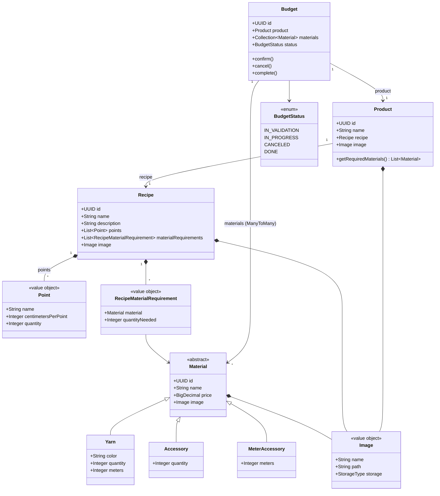
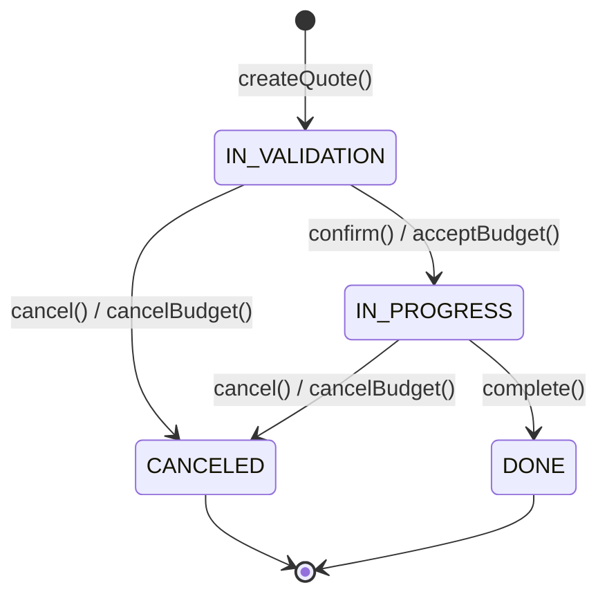
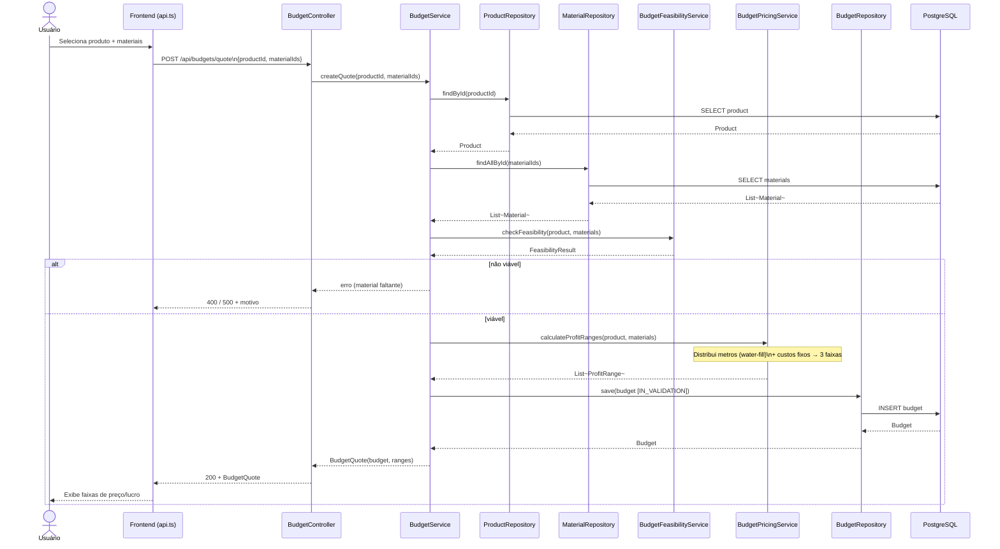
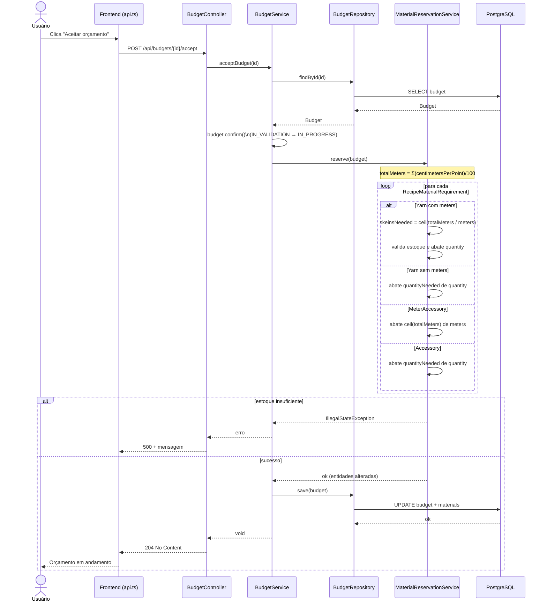
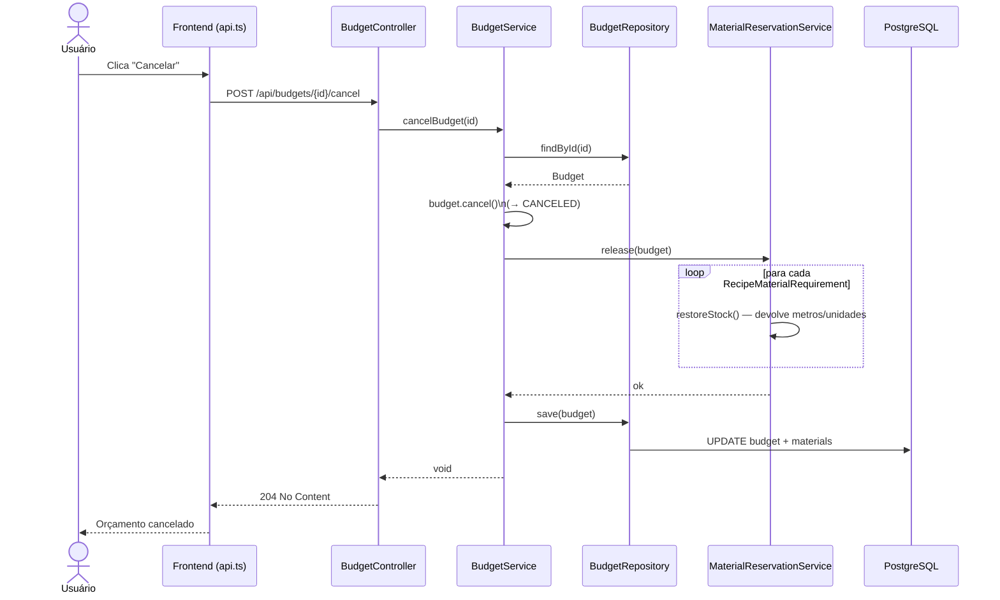

# Documento de Arquitetura — Crochetapp

> Sistema de gestão para ateliê de crochê: cadastro de materiais, receitas e produtos,
> com geração de orçamentos (cotações), análise de viabilidade, precificação por faixas
> de lucro e reserva automática de estoque.

---

## 1. Visão Geral

O **Crochetapp** é uma aplicação web composta por dois grandes blocos:

- **Frontend** — Single Page Application em **Next.js / React / TypeScript**, responsável pela
  interface de usuário (CRUD de materiais, receitas, produtos e orçamentos).
- **Backend** — API REST em **Spring Boot / Java**, que concentra as regras de negócio e a
  persistência em **PostgreSQL**.

A comunicação entre as camadas é feita via **HTTP/JSON** sobre uma API REST exposta sob o prefixo
`/api`. O backend segue uma arquitetura em camadas inspirada em **DDD (Domain-Driven Design)**,
separando claramente *controllers*, *application services*, *domain services*, *domain model* e
*infrastructure*.

| Camada | Tecnologia | Responsabilidade |
|--------|-----------|------------------|
| Apresentação | Next.js, React, TypeScript, Base UI | Interface e experiência do usuário |
| API / Comunicação | REST/JSON, CORS | Contrato HTTP entre front e back |
| Aplicação | Spring `@Service` | Orquestração de casos de uso |
| Domínio | POJOs / Value Objects | Regras de negócio e invariantes |
| Infraestrutura | Spring Data JPA / Hibernate | Persistência e configuração |
| Banco de Dados | PostgreSQL (Docker) | Armazenamento relacional |

---

## 2. Arquitetura de Componentes

O diagrama abaixo apresenta os principais componentes do sistema e suas dependências.

```mermaid
flowchart TB
    subgraph Browser["Navegador"]
        subgraph FE["Frontend — Next.js / React"]
            Pages["Páginas\nmaterials · recipes · products · budgets"]
            ApiClient["API Client\n(lib/api.ts)"]
            Pages --> ApiClient
        end
    end

    subgraph Backend["Backend — Spring Boot"]
        subgraph Controllers["Camada de Controllers (REST)"]
            MC["MaterialController\n/api/materials"]
            RC["RecipeController\n/api/recipes"]
            PC["ProductController\n/api/products"]
            BC["BudgetController\n/api/budgets"]
        end

        subgraph AppServices["Camada de Aplicação (Use Cases)"]
            MS["MaterialService"]
            RS["RecipeService"]
            PS["ProductService"]
            BS["BudgetService"]
        end

        subgraph DomainServices["Serviços de Domínio"]
            FS["BudgetFeasibilityService"]
            PRS["BudgetPricingService"]
            MRS["MaterialReservationService"]
        end

        subgraph Domain["Modelo de Domínio"]
            Budget["Budget"]
            Product["Product"]
            Recipe["Recipe"]
            Material["Material\n(Yarn · Accessory · MeterAccessory)"]
        end

        subgraph Infra["Infraestrutura (Spring Data JPA)"]
            BRepo["BudgetRepository"]
            PRepo["ProductRepository"]
            RRepo["RecipeRepository"]
            MRepo["MaterialRepository\n(+ Yarn/Accessory/MeterAccessory)"]
        end
    end

    DB[("PostgreSQL\ncrochetdb")]

    ApiClient -- "HTTP/JSON\n(CORS :3000 → :8080)" --> Controllers

    MC --> MS
    RC --> RS
    PC --> PS
    BC --> BS

    BS --> FS
    BS --> PRS
    BS --> MRS

    MS --> MRepo
    RS --> RRepo
    RS --> MRepo
    PS --> PRepo
    BS --> BRepo
    BS --> PRepo
    BS --> MRepo

    FS --> Domain
    PRS --> Domain
    MRS --> Domain

    BRepo --> DB
    PRepo --> DB
    RRepo --> DB
    MRepo --> DB
```

### 2.1 Descrição das Camadas

#### Controllers (REST)
Expõem os endpoints HTTP e delegam para os *application services*. Cada controller cobre um agregado.

| Controller | Base | Endpoints principais |
|-----------|------|----------------------|
| `MaterialController` | `/api/materials` | `GET`, `GET /{id}`, `POST`, `PUT /{id}`, `DELETE /{id}` |
| `RecipeController` | `/api/recipes` | `GET`, `GET /{id}`, `POST`, `PUT /{id}`, `DELETE /{id}` |
| `ProductController` | `/api/products` | `GET`, `GET /{id}`, `POST`, `PUT /{id}`, `DELETE /{id}` |
| `BudgetController` | `/api/budgets` | CRUD + `POST /quote`, `POST /{id}/accept`, `POST /{id}/cancel` |

#### Application Services (Casos de Uso)
Orquestram o fluxo de cada operação, coordenando repositórios e serviços de domínio.
O destaque é o `BudgetService`, que combina os três serviços de domínio para gerar
cotações e gerenciar o ciclo de vida do orçamento.

#### Domain Services (Regras de Negócio)
- **`BudgetFeasibilityService`** — verifica se todos os materiais exigidos pela receita do
  produto estão presentes no orçamento. Retorna um `FeasibilityResult`.
- **`BudgetPricingService`** — calcula o custo total e três faixas de lucro
  (Conservadora, Equilibrada, Premium). Usa um algoritmo de *water-fill* para distribuir
  os metros da receita entre os materiais "metrados" (fios e acessórios por metro).
- **`MaterialReservationService`** — abate (`reserve`) ou devolve (`release`) estoque ao
  aceitar/cancelar um orçamento.

#### Infrastructure (Persistência)
Interfaces `JpaRepository` que abstraem o acesso ao PostgreSQL via Hibernate.
`MaterialRepository` é polimórfico (herança *single table* com coluna discriminadora `type`).

---

## 3. Modelo de Domínio

### 3.1 Hierarquia de Materiais

A herança usa estratégia **SINGLE_TABLE** com coluna discriminadora `type`:

| Subtipo | Discriminador | Campos específicos | Lógica de estoque |
|---------|---------------|--------------------|-------------------|
| `Yarn` | `YARN` | `color`, `quantity` (novelos), `meters` (m/novelo) | Por metro **ou** por unidade (quando `meters` nulo) |
| `Accessory` | `ACCESSORY` | `quantity` (unidades) | Por unidade (`quantityNeeded`) |
| `MeterAccessory` | `METER_ACCESSORY` | `meters` (metros disponíveis) | Por metro |

### 3.2 Máquina de Estados do Orçamento

---

## 4. Diagramas de Sequência

### 4.1 Geração de Orçamento (Cotação)

Fluxo do endpoint `POST /api/budgets/quote`, que valida viabilidade, calcula faixas de
lucro e persiste o orçamento em estado `IN_VALIDATION`.

### 4.2 Aceitação de Orçamento e Reserva de Estoque

Fluxo do endpoint `POST /api/budgets/{id}/accept`. Confirma o orçamento
(`IN_VALIDATION → IN_PROGRESS`) e abate o estoque dos materiais conforme a receita.

### 4.3 Cancelamento de Orçamento e Devolução de Estoque

Fluxo do endpoint `POST /api/budgets/{id}/cancel`, espelho do anterior: devolve o
estoque previamente reservado.

---

## 5. Regras de Negócio Relevantes

### 5.1 Viabilidade (`BudgetFeasibilityService`)
Um orçamento só é viável se **todos** os materiais exigidos pela receita do produto
(`product.getRequiredMaterials()`) estiverem entre os materiais selecionados no orçamento.
Caso contrário, retorna `FeasibilityResult.isNotFeasible(motivo)`.

### 5.2 Precificação (`BudgetPricingService`)
1. Calcula `totalMeters` a partir dos pontos da receita.
2. **Materiais metrados** (Yarn com `meters` e MeterAccessory): o custo é distribuído via
   *water-fill* — preenche primeiro os materiais de menor capacidade.
3. **Materiais de custo fixo** (Accessory e Yarn sem `meters`): `price × quantityNeeded`.
4. Custo total = custo metrado + custo fixo.
5. Gera 3 faixas de lucro:
   - **Conservadora** — 30% a 50% (× 1,30 a 1,50)
   - **Equilibrada** — 50% a 100% (× 1,50 a 2,00)
   - **Premium** — 100% a 200%+ (× 2,00 a 3,00)

### 5.3 Reserva de Estoque (`MaterialReservationService`)
Trata cada subtipo de material de forma específica. Para **fio sem metros cadastrados**,
o abatimento/devolução ocorre por **unidade** (`quantityNeeded`), evitando divisão por
valor nulo. Lança `IllegalStateException` quando o estoque é insuficiente.

---

## 6. Infraestrutura e Configuração

### 6.1 Banco de Dados
- **PostgreSQL 13** em container Docker (`docker-compose.yaml`).
- Banco `crochetdb`, porta `5432`, usuário/senha `admin/admin`.
- `spring.jpa.hibernate.ddl-auto=update` — o schema é criado/atualizado automaticamente.

### 6.2 CORS
`CorsConfig` libera o padrão `/api/**` para a origem do frontend
(`http://localhost:3000` por padrão), com os métodos `GET, POST, PUT, DELETE`.

### 6.3 Portas
| Serviço | Porta |
|---------|-------|
| Frontend (Next.js) | `3000` |
| Backend (Spring Boot) | `8080` |
| PostgreSQL | `5432` |

---

## 7. Contrato da API (resumo)

| Recurso | Método | Caminho | Descrição |
|---------|--------|---------|-----------|
| Materiais | GET/POST | `/api/materials` | Listar / criar |
| Materiais | PUT/DELETE | `/api/materials/{id}` | Atualizar / remover |
| Receitas | GET/POST | `/api/recipes` | Listar / criar (`SaveRecipeRequest`) |
| Receitas | PUT/DELETE | `/api/recipes/{id}` | Atualizar / remover |
| Produtos | GET/POST | `/api/products` | Listar / criar |
| Produtos | PUT/DELETE | `/api/products/{id}` | Atualizar / remover |
| Orçamentos | GET/POST | `/api/budgets` | Listar / criar |
| Orçamentos | PUT/DELETE | `/api/budgets/{id}` | Atualizar / remover |
| Orçamentos | POST | `/api/budgets/quote` | Gerar cotação |
| Orçamentos | POST | `/api/budgets/{id}/accept` | Aceitar (reserva estoque) |
| Orçamentos | POST | `/api/budgets/{id}/cancel` | Cancelar (devolve estoque) |

Todos os identificadores são **UUID**. Materiais são serializados de forma **polimórfica**
(campo `type` distingue `YARN`, `ACCESSORY`, `METER_ACCESSORY`).
